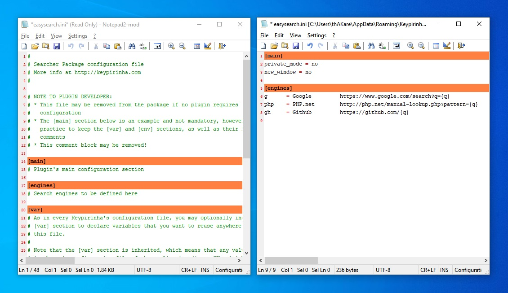
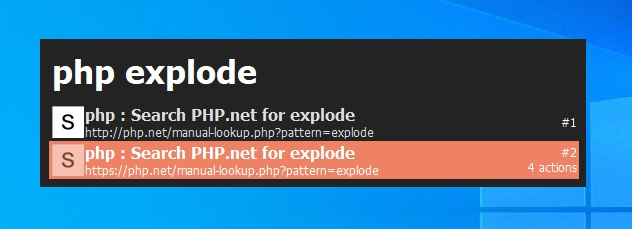

# Keypirinha Plugin: EasySearch

This is EasySearch, a plugin for the
[Keypirinha](http://keypirinha.com) launcher.

This package provides a easiest and flexible way to search the internet, just like WebSearch package but even simpler.


## Download

Download the plugin file from [here](https://github.com/bantya/Keypirinha-EasySearch/releases).


## Install

Once the `EasySearch.keypirinha-package` file is installed,
move it to the `InstalledPackage` folder located at:

* `Keypirinha\portable\Profile\InstalledPackages` in **Portable mode**
* **Or** `%APPDATA%\Keypirinha\InstalledPackages` in **Installed mode** (the
  final path would look like
  `C:\Users\%USERNAME%\AppData\Roaming\Keypirinha\InstalledPackages`)


## Usage
1. Open the EasySearch config file.


2. Add the desired web search URLs.
* The syntax for the URL entry should be:
    ```
    [distinct keyword] = [Search Engine name] [Search Engine URL with %s as a search term]

    e.g.

    g = Google https://www.google.com/search?q={q}
    php = PHP.net http://php.net/manual-lookup.php?pattern={q}
    gh = Github https://github.com/search?utf8=✓&q={q}
    ```
* All the fields in the above syntax are REQUIRED.



3. Invoke Keypirinha and put the search engine keyword and the search term.
* The syntax for the usage should be:
    ```
    [keyword] [Search term (can contain spaces)]

    e.g.

    g  keypirinha launcher  -> searches 'keypirinha launcher' on google
    gh  bantya/Keypirinha-EasySearch  -> searches 'bantya/Keypirinha-EasySearch' on github
    ```


## What's new ?

### https for non-https URL
If the URL protocol is just `http`, then along with it an `https` URL is also generated.



### Actions
Starting from `v2.0.0`, following actions are available for any generated URL.


* **Copy link**: Copy the URL to the clipboard.
* **Open**: Open the URL in the browser.
* **Private mode**: Open the URL in new browser window.
* **New windows**: Open the URL in the private mode.


## Change Log

Please check the [CHANGELOG](./CHANGELOG.md) file.


## License

This package is distributed under the terms of the MIT license.


## Credits

_Waiting for the first name_.


## Contribute

This is how to contribute:
1. Check for open issues or open a fresh issue to start a discussion around a
   feature idea or a bug.
2. Fork this repository on GitHub to start making your changes to the **dev**
   branch.
3. Send a pull request.
4. Add yourself to the *Contributors* section below (or create it if needed)!

## And what?

Thanks to all.
